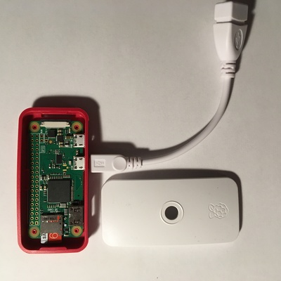

# iPibackup: backup your iPhone while charging it

## Introduction

This project aims to provide a simple and transparent way to backup an Apple
iPhone (or iPad) while charging it (for example at night).

For people who don't use iCloud backups or iTunes backups over Wi-Fi, backup
frequency can be rather low. Backups should the most simple and transparent
possible, or one won't do it at all (and regret it later).

Fortunately, thanks to a combination of software (like
[libimobiledevice](http://www.libimobiledevice.org/)) and hardware (like a
[Raspberry Pi](https://www.raspberrypi.org/) Zero) it's possible to create a
device which will both charge and back your phone, every time you plug it.

> **Note:**
That also means it's quite easy to do that with anything that looks like a
phone charger. Don't plug your phone to random stuff. If you're asked to trust
something and type your passcode, that will give access to your phone to
anything at the other side of the cable. Including that speaker/alarm in your
hotel room (no, you don't need to type your passcode just to transmit music)
>

## Setup

### Hardware

Just pick any computer you'd like to dedicate to this. I think the best
candidates are all the _single board computers_ available these days, and I
especially like the Raspberry Pi Zero for that, so all this README assumes that
target device, but it should be trivial to port it to other devices.

The Raspberry Pi Zero has two micro-USB port: one for power, one for an USB
device. We'll use the former to provide power to the RPi, and the latter to
provide charging power to the iPhone and take the backup. Be sure to also pick
a good power supply and a micro-USB male to USB-B female adapter (or a
micro-USB male to lightning adapter, but a cable might be more flexible).

Also pick a micro-SD card large enough to host both the system (current
Raspbian lite uses around 1GB and it should be quite possible to strip it more)
and your backup. Since the Raspberry Pi Zero only has one usable USB port, we
have to use the micro-SD card for everything. If you use a different device
with more USB port then you can also use a standard USB key.

I had good success with the Melopero Raspberry Pi Zero W starter kit:



### Software

#### System preparation

Download the latest [Rasbian
lite](https://downloads.raspberrypi.org/raspbian_lite_latest) and unzip it:

```shell
$ wget https://downloads.raspberrypi.org/raspbian_lite_latest
$ unzip raspbian_lite_latest
```

Then burn the resulting image to your micro-SD card (adjust file and device
names):

```shell
# dd if=2018-04-18-raspbian-stretch-lite.img of=/dev/mmcblk0 bs=4M
```

#### System configuration

> **Note**:
Current Raspbian lite doesn't include some specific software we need, so we'll
have to install it manually. That means if we only have a Raspberry Pi Zero
with no way to connect to the Internet, things are starting to get a bit ugly.
My workaround was to first to the setup using a Raspberry Pi 2, then put the SD
card in the Zero.
>

Boot the just burned SD-card and log in (either on an attached keyboard and
screen, on an UART or remotely over SSH if you can plug it to a network;
[Raspberry Pi Zero headless
setup](https://medium.com/@DavidMaitland/raspberry-pi-zero-headless-setup-92fb72daf88d)
can be helpful here too)

You can adjust some parameters (locales, timezone etc.) using `raspi-config` as
root. We'll also allocate more power to the USB port so charging is a bit
faster (I didn't measure it and I don't really care since it charges at night,
but by default I think the USB port won't provide more than 500mA which is
really low)

```shell
# echo max_usb_current=1 >> /boot/config.txt
```

`libimobiledevice` as included in Debian Stretch (on which current Raspbian is
based) doesn't support iOS 11, so for the time beeing we'll need to pick
packages from Buster:

```shell
# sed -i 's/stretch/buster' /etc/apt/sources.list
# apt update
# apt install libimobiledevice-utils
```

#### Service configuration

The backup itself is done using a simple [systemd unit
file](systemd/ipibackup.service). Drop it into `/etc/systemd/system` and enable
it with:

```shell
# systemctl enable ipibackup
```

## Usage

### Backup

Just plug an iPhone (using a standard lightning cable plus the USB female
adapter). When asked by the system, chose _Trust_ and enter your passcode. The
backup should start after few seconds. The syncing indicator (spinning arrows
next to the wireless or cellular indicator) will stay on during the whole
backup. The initial one will take some time, especially if you have a lot of
data on your iPhone, but subsequent ones will be faster.

The backup is stored in `/home/pi/iphone` in a subdirectory identified by the
iPhone serial number.

> **Note**
It's really recommended to configure a backup password on the iPhone (either on
iTunes or using `idevicebackup2 -i encryption on`). That way the backup content
is encrypted on the SD card, and the backup itself contains more data (like the
keychain content)

### Direct feedback and debug

If it doesn't work, it really helps having remote access to the charger and
look at the journal (`journalctl -f`) when doing a backup.

The unit file also has support for lighting a LED on GPIO#18 when backup
starts, and switching off when it's done, so you can also solder one (don't
forget the resistor).

### Restore

If you need to do a restore, you can just put the microSD card in a different
computer, plug your iPhone and do the restore from there, using:

```shell
$ idevicebackup2 -i restore /path/to/backup/folder
``` 

> **Note**:
The archive format is compatible with iTunes so it should be possible to
restore from it, but right now the backup sits on an ext4 partition which is
not readable on Windows or MacOS.

## Future work

Some ideas for the future:

- [ ] move backup to separate, VFAT partition for easier MacOS/Windows restore
- [ ] support remote backup host (maybe using sshfs?)
- [ ] investigation various HAT, pHAT and shims for user feedback (e.g
  [Pimoroni buttons shim](https://shop.pimoroni.com/products/button-shim))
- [ ] find a way to get and report backup failure
